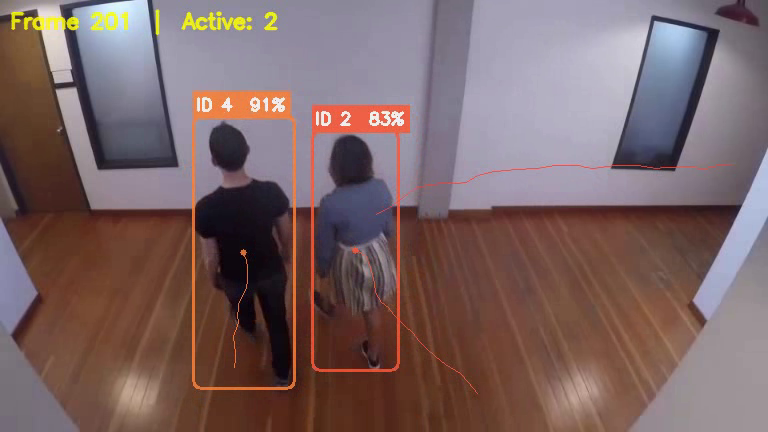

# Multi-Object Detection and Persistent ID Tracking

A computer vision pipeline that detects and tracks multiple subjects in video footage, assigning consistent unique IDs across all frames. Built with **YOLOv8** for real-time object detection and **BoT-SORT** for robust multi-object tracking.



---

## 🎯 Features

- **Real-time object detection** using YOLOv8 (nano model for speed)
- **Persistent ID tracking** via BoT-SORT with re-identification
- **Trajectory trail visualisation** – shows movement paths per subject
- **Movement heatmap** – density map of all tracked positions
- **Object count over time** – temporal chart of active subjects
- **Annotated output video** with bounding boxes, IDs, and confidence scores
- **Auto-generated analytics** saved as JSON

---

## 📋 Requirements

- Python 3.8+
- CUDA-capable GPU recommended (CPU mode also works)
- ~500 MB disk space for model weights + video

---

## 🚀 Installation

```bash
# 1. Clone the repository
git clone https://github.com/rudragauswami/predusk_assesment.git
cd predusk_assesment

# 2. Create a virtual environment (recommended)
python -m venv venv
source venv/bin/activate      # Linux/macOS
# or
venv\Scripts\activate          # Windows

# 3. Install dependencies
pip install -r requirements.txt
```

---

## ▶️ How to Run

### Basic usage (uses default video)

```bash
python main.py
```

### Custom video & options

```bash
python main.py \
    --video path/to/your_video.mp4 \
    --output output/result.mp4 \
    --model yolov8s.pt \
    --tracker botsort.yaml \
    --conf 0.4 \
    --target-class 0 \
    --trail-length 50
```

### CLI Arguments

| Argument         | Default                    | Description                                       |
|------------------|----------------------------|---------------------------------------------------|
| `--video`        | `people-detection.mp4`     | Path to the input video                           |
| `--output`       | `output/annotated_video.mp4` | Path for the annotated output                   |
| `--model`        | `yolov8n.pt`               | YOLOv8 model (`yolov8n`, `yolov8s`, `yolov8m`)   |
| `--tracker`      | `botsort.yaml`             | Tracker config (`botsort.yaml` / `bytetrack.yaml`)|
| `--conf`         | `0.35`                     | Detection confidence threshold                    |
| `--target-class` | `0`                        | COCO class index (0 = person)                     |
| `--trail-length` | `40`                       | Trajectory trail length (frames)                  |
| `--skip-frames`  | `0`                        | Process every N-th frame (0 = all)                |

---

## 📂 Output Structure

```
output/
├── annotated_video.mp4       # Main output with bounding boxes + IDs
├── trajectory_map.png        # Full-video trajectory visualization
├── heatmap.png               # Movement density heatmap
├── count_over_time.png       # Object count temporal chart
├── analytics.json            # Processing metrics & stats
└── screenshots/
    ├── screenshot_1.png      # Sample frame (early)
    ├── screenshot_2.png      # Sample frame (mid)
    └── screenshot_3.png      # Sample frame (late)
```

---

## 🎥 Source Video

- **Video**: `people-detection.mp4` from [Intel IoT DevKit Sample Videos](https://github.com/intel-iot-devkit/sample-videos)
- **Direct link**: https://github.com/intel-iot-devkit/sample-videos/blob/master/people-detection.mp4
- **Content**: Multiple people walking across a scene with occlusions and varying scales
- **License**: Publicly available for research and educational use

---

## 🧠 Model & Tracker Choices

| Component   | Choice     | Rationale                                                  |
|-------------|------------|------------------------------------------------------------|
| Detector    | YOLOv8n    | Best speed-accuracy tradeoff; single-stage, real-time      |
| Tracker     | BoT-SORT   | Combines Kalman filter + ReID features for robust tracking |
| Framework   | Ultralytics| Unified API for detection + tracking; well-maintained      |

See [report.md](report.md) for a detailed technical write-up.

---

## ⚠️ Assumptions & Limitations

### Assumptions
- The primary subjects of interest are **people** (COCO class 0)
- The input video has a reasonable resolution (480p–1080p) and frame rate
- BoT-SORT defaults are sufficient for the demo scenario

### Limitations
- **ID switches**: Can occur during prolonged full occlusion of similar-looking subjects
- **Crowded scenes**: Very dense crowds may cause missed detections at low confidence
- **Nano model**: YOLOv8n prioritises speed over accuracy — use `yolov8s.pt` or `yolov8m.pt` for better precision
- **No audio**: Output video does not retain audio from the source
- **Single class**: Currently tracks one class at a time (configurable via `--target-class`)

---

## 📜 License

This project is for educational and assessment purposes.  
The sample video is sourced from [Intel IoT DevKit](https://github.com/intel-iot-devkit/sample-videos) (public domain).
